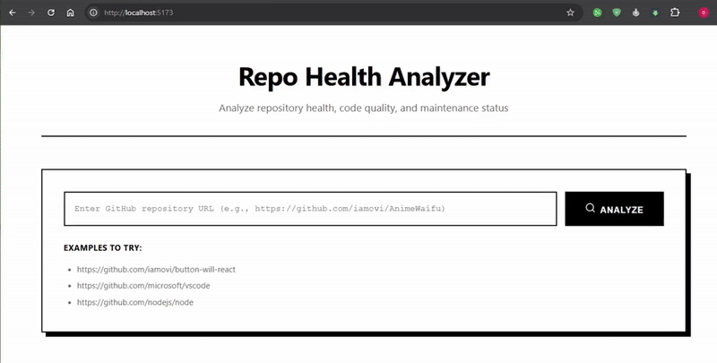

# Repo Health Analyzer (repoana)

A production-ready web application that analyzes GitHub repositories and provides comprehensive health scores, detailed breakdowns, and actionable recommendations for improvement.



## ✨ Features

- **Overall Health Score**: Get a comprehensive 0-100 score for any GitHub repository
- **Category Breakdown**: Detailed analysis across 5 key areas:
  - 📄 Documentation Quality
  - 💻 Code Quality
  - 🔧 Maintenance Status
  - 👥 Community Engagement
  - 📈 Activity Level
- **Smart Recommendations**: Prioritized suggestions for improving repository health
- **Beautiful UI**: Modern, responsive design with smooth animations
- **Fast & Efficient**: Optimized API calls and data processing
- **No Authentication Required**: Works out of the box (with rate limits)

## ^_^ Live Project

⨠ https://iamovi.github.io/repoana/

## 🚀 Quick Start

### Prerequisites

- Node.js 16+ installed
- npm or yarn package manager

### Installation

```bash
# 1. Clone or create the project
git clone https://github.com/iamovi/repoana.git

# 2. Change directory
cd repoana

# 3. Install dependencies
npm install

# 4. Start development server
npm run dev

# 5. Open browser at http://localhost:5173/repoana
```

## 🎯 How It Works

1. **Input**: User enters a GitHub repository URL
2. **Fetch**: App retrieves data using GitHub REST API:
   - Repository metadata
   - Files and documentation
   - Issues and pull requests
   - Commits and contributors
   - Community health metrics
3. **Analyze**: Calculates scores based on:
   - Documentation completeness
   - Issue management
   - Commit activity
   - Community engagement
   - Maintenance patterns
4. **Report**: Displays results with:
   - Overall health score
   - Category breakdowns
   - Actionable recommendations

## 📊 Scoring System

### Documentation (25% weight)
- README quality and completeness
- License file presence
- Contributing guidelines
- Issue/PR templates
- Wiki or docs folder

### Code Quality (20% weight)
- Issue close rate
- PR merge rate
- Issue response time
- Template availability

### Maintenance (25% weight)
- Recent commit activity
- Commit frequency
- Active contributors
- Days since last update

### Community (15% weight)
- Stars count
- Forks count
- Watchers count
- Community health score

### Activity (15% weight)
- Recent issues
- Recent pull requests
- Recent commits

## 🔑 GitHub API Rate Limits

### Without Token (Default)
- 60 requests per hour per IP address
- Sufficient for testing and personal use

### With Personal Access Token (Optional)
- 5,000 requests per hour
- Create token at: https://github.com/settings/tokens
- No special permissions needed
- Add to `.env` file:

```bash
VITE_GITHUB_TOKEN=ghp_your_token_here
```

## 🐛 Troubleshooting

### Port Already in Use
```bash
npx kill-port 5173
npm run dev
```

### API Rate Limit Exceeded
- Wait 1 hour for limit reset, or
- Add GitHub Personal Access Token

### Module Not Found Errors
```bash
rm -rf node_modules package-lock.json
npm install
```

### Build Fails
```bash
# Clear cache
rm -rf node_modules dist .vite
npm install
npm run build
```

## 📝 License

MIT License - feel free to use this project for personal or commercial purposes.

## 👨‍💻 Author

**Ovi Ren**
- GitHub: [@iamovi](https://github.com/iamovi)
- Portfolio: [iamovi.github.io](https://iamovi.github.io)

## 🙏 Acknowledgments

- GitHub REST API for providing comprehensive repository data
- React and Vite for the amazing developer experience
- Lucide React for beautiful icons
- Recharts for potential data visualization

## 📧 Support

Found a bug or have a feature request? 
- Open an issue on GitHub
- Contact via portfolio website

---

Made with ❤️ by Ovi | Star ⭐ if you find this useful!